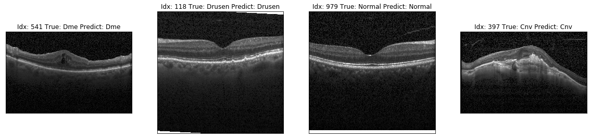
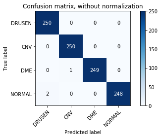
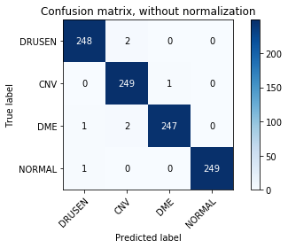
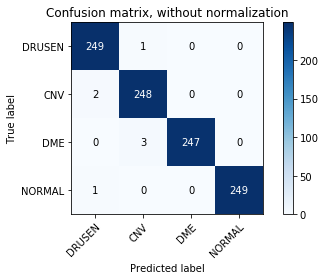

# OCTnet Classifier
This repository contains a code of experiments conducted as part of research work http://ptsj.ru/articles/416/416.pdf. We have implemented classificator of OCT images with use of PyTorch DL framework. We have conducted comparative analysis of CNN architectures of varying complexity and have chosen the most effective one, that show excellent results on the validation sample.

<p align="center"></p>

### Install needed package
Used version of python - 3.7 (we recommend using virtualenv). 

First need to install some libraries for image processing and deep learning framework. All packages that you need to install described in requirements.txt.

```
pip3 install -r requirements.txt
```

### Data
As a training and test dataset we used https://data.mendeley.com/datasets/rscbjbr9sj/2. 

##### Download data
```
$ cd dataset/
$ bash get_oct_data.sh
```
You can execute the code from `data_visualize.ipynb` to get acquainted with the data.

### Train
```
$ python train.py
```
We have compared some architectures of varying complexity. Initially we tried to train VGG16, then we began to reduce the complexity of the model. The result of our experiments was that we were able to train the lightest model Squeezenet1.1 and were able to achieve accuracy on the validation sample of 99.7%. We have trained the lightest model Squeezenet1.1 and have achieved accuracy on the validation sample of 99.7%. It is possible that such incredible accuracy is due to the fact that the data distribution in the training and test samples is very similar.

##### Tensorboard
Track training progress in Tensorboard:
* Initialize training
* Run the command below
* Go to http://localhost:6006/

```
$ tensorboard --logdir='runs'
```


### Eval
The script for evaluating models is located in `eval.ipynb`.

##### Squeezenet1.1
| Class       | F1 score | Precision | Recall |
| ------------|:--------:|:---------:|:------:|
| DRUSEN      | 1.0      |0.99       |1.0     |
| CNV         | 1.0      |1.0        |1.0     |
| DME         | 1.0      |1.0        |1.0     |
| NORMAL      | 1.0      |1.0        |0.99    |

Accuracy 99.7 %

<p align="center"></p>

##### DenseNet121
| Class       |  F1 score | Precision  | Recall |
| ------------|:---------:|:----------:|:------:|
| DRUSEN      | 0.99      |0.99        |0.99    |
| CNV         | 0.99      |0.98        |1.0     |
| DME         | 0.99      |1.0         |0.99    |
| NORMAL      | 1.0       |1.0         |1.0     |

Accuracy 99.3 %

<p align="center"></p>

##### VGG16
| Class       |  F1 score | Precision  | Recall  |
| ------------|:---------:|:----------:|:-------:|
| DRUSEN      | 0.99      |0.99        |1.0      |
| CNV         | 0.99      |0.98        |0.99     |
| DME         | 0.99      |1.0         |0.99     |
| NORMAL      | 1.0       |1.0         |1.0      |

Accuracy 99.3 %

<p align="center"></p>

As you can see, Squeezenet1.1 with simple architecture is not inferior to the VGG16 with more difficult architecture.

### Authors
Tsykunov D.V. — student, Department of Biomedical Engineering systems, Bauman Moscow State Technical University, Moscow, Russian Federation.

Moiseeva V.A. — student, Department of Biomedical Engineering systems, Bauman Moscow State Technical University, Moscow, Russian Federation.